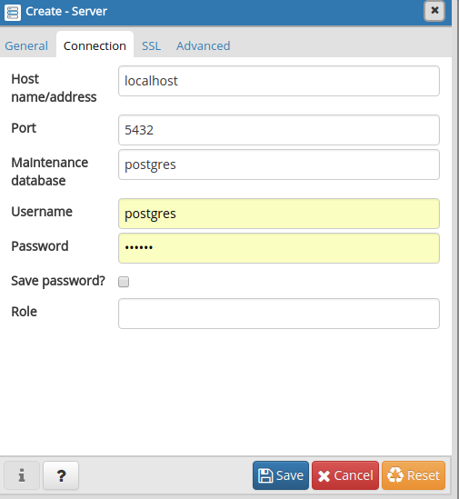
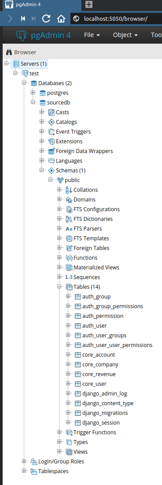

# mini-holvi

## Compatibility
Python 3.6 only. Type-hints and F-strings

## How to setup

### 0. Clone the repo

### 1. Install requirements (create a venv with your favourite tool of choice)
```pip install -r requirements.txt```

### 2. Start the database for tests
```docker run --net=host --name some-postgres -e POSTGRES_PASSWORD=secret -d postgres:latest```

### 3. Create the initial schema and populate the db with sample data
```
python manage.py migrate
python manage.py repopulate_test_data
```

### 4. (Optional) check the contents with your own eyes using pgadmin4 from this trusted source:
```
docker run --net=host --rm -p 5050:5050 thajeztah/pgadmin4
```
open the [pgadmin4 cp](localhost:5050)




